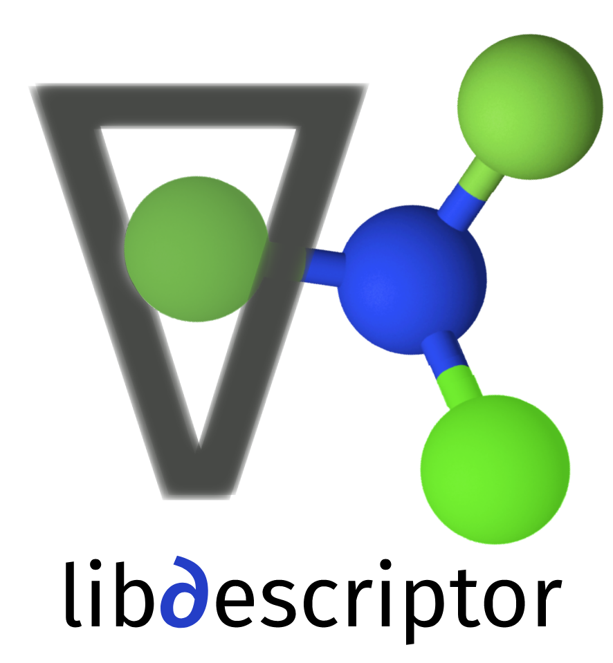

Libdescriptor
==============
<center>

</center>
Libdescriptor is a high performance descriptor library for providing access to fully differentiable descriptor functions.
While `libdescriptor` is a general purpose descriptor library, it's API compatible with KIM models and associated projects.
This will also provide uniform access to various selected descriptors for KLIFF using Pybind11 ports.
For gradient calculations, Libdescriptor relies on [Enzyme AD](https://github.com/EnzymeAD/Enzyme) and [Autodiff](https://github.com/autodiff/autodiff), which provides it with capability to trivially generate near analytical performance gradient functions.
Use of Enzyme AD enables Libdescriptor to not only provide gradients against coordinates, but against hyperparameters as well, thus opening way for better optimized descriptors.
This should enable rapid development, extension and deployment of various descriptors.


While the EnzymeAD is provided to high-performance, near-analytical throughput gradient calculations, it is not the most
trivial piece of software to compile and use. Hence, the default version uses lightweight, header only Autodiff library,
which was 2nd most performant in our tests. For using the Enzyme version of the library, you can use the `enzyme` branch.


## Installation
For AMD/Intel based Linux systems, we provide a precompiled binary package for libdescriptor. It can be installed using
```shell
pip install libdescriptor
```

## Compiling 
### Autodiff version
To compile the library, you need to have a C++17 compatible compiler, and CMake 3.10 or higher. Compiling is straightforward,
```shell
git clone https://github.com/ipcamit/libdescriptor
cd libdescriptor && mkdir build && cd build
cmake .. -DCMAKE_BUILD_TYPE=Release
make && make install
```
This will compile and install the `libdescriptor.so` file in your system and `libdescriptor.cpython-xxxx.so` Python module. 
You can link against this file in your own projects. If you want to use only the Python module, you can simply do
```shell
pip install .
```

### Enzyme version
At present, it needs functioning Enzyme compiler environment, in future it will be provided as binary package or a conda environment.
For Installing Enzyme, simply follow the instructions given on enzyme page. At the time of writing these instructions, we are using
- LLVM 13.0.1
- Enzyme v0.0.86

Although Enzyme recommends compiling LLVM/Clang from scratch, in our experience precompiled stock binaries also work fine.
Though depending on your platform, your mileage may wary.

Steps to compile **Enzyme**:
```shell
# Get the Clang/LLVM binaries
wget https://github.com/llvm/llvm-project/releases/download/llvmorg-13.0.1/clang+llvm-13.0.1-x86_64-linux-gnu-ubuntu-18.04.tar.xz
# Untar and export environment variables
tar -xvf clang+llvm-13.0.1-x86_64-linux-gnu-ubuntu-18.04.tar.xz
export PATH="/path/to/clang/extract/bin:"$PATH
export INCLUDE="/path/to/clang/extract/include:"$INCLUDE
export LD_LIBRARY_PATH="/path/to/clang/extract/lib:"$LD_LIBRARY_PATH

# Clone and compile Enzyme
git clone https://github.com/EnzymeAD/Enzyme
cd Enzyme/enzyme
git checkout v0.0.86
mkdir build; cd build
CC=clang CXX=clang++ cmake .. -DLLVM_DIR=/path/to/clang/lib/cmake/llvm
make 
# optional make install if you want
```
Now your enzyme is ready to use. For compiling your code, you would need to know the location of your compiled Enzyme libraries. 
In the build folder you should see 3 shared objects: `ClangEnzyme-12.so`, `LLDEnzyme-12.so`, and `LLVMEnzyme-12.so`.
As a rule of thumb, you need `ClangEnzyme` for compiling single file programs, whereas more complicated build schemes (such as used in this program),
needs creating derivatives at link time, using `LLDEnzyme` file. 

You need to provide the location of `LLDEnzyme` to the `Cmake` file for successful build.
This can be done simply by defining Cmake variable. To build `libdescritpor`
```shell
git clone https://github.com/ipcamit/colabfit-descriptor-library
cd colabfit-descriptor-library
mkdir build; cd build
cmake .. -DENZYME_LIB=/path/to/*Enzyme.so/files -DCMAKE_BUILD_TYPE=Release
make
```
Your build folder should now contain `libdescriptor.so` file, which you can link against your own projects.


## Python bindings

Libdescriptor also provides build target for making `descriptor.cpython-cp3.xx.so` Python module using Pybind11.
To use it, you need to install Pybind11 on your system
> Note: pip installation of Pybind11 can cause issues with compiling (it is a known Pybind11 limitation) 
> so it is recommended to use either system installer like `apt` or `rpm`  or use `conda`.

## Descriptors supported (or planned)
- [x] Behler Symmetry Functions
- [x] Bispectrum 
- [x] SOAP
- [ ] ACE (WIP)

## Extending Libdescriptor
New descriptors can be added by extending the `DescriptorKind` class, and implementing its `compute` function.
`compute` function will compute the descriptor for single atom. It is also advised to write a `clone_empty` function if you want
to take derivatives against hyperparamters. Without an empty clone, Enzyme can segfault at times when default constructor does not initialize
all fields of class properly.

> When in doubt, make your code more "C" like for higher success rate.

TODO: More documentation for extending.

## Docker Image
The repository now contains a Dockerfile, which can be used to install the descriptor library in an isolated environment.
It is based on Kim Developer Platform Docker image, so that you have infrastructure to use it out-of-the-box. However, 
it is  independent of KIM, and can be used for your personal projects. In doing so, you can edit the dockerfile and base
it on your own project image as per need.

---
<small>

### Clad Support
[Clad](https://clad.readthedocs.io/en/latest/index.html) is another alternative to Enzyme that looks promising, and 
more mature. It is tightly integrated to C++ and hence can easily work with most OOP patterns without any issues.
For higher performance Clad can even interface with Enzyme, for best-of-both-worlds. Major difference between Clad and 
Enzyme is the compiler level they interject themselves at. At present, I am freezing the `libdescriptor` with Enzyme, but
given the design of the library, it is rather trivial to have a working port for Clad. 
In future I should include Clad support if it turns out to be as performant as using Enzyme out of the box.
Major positive of Clad would be nicer API for the end user to extend.
</small>